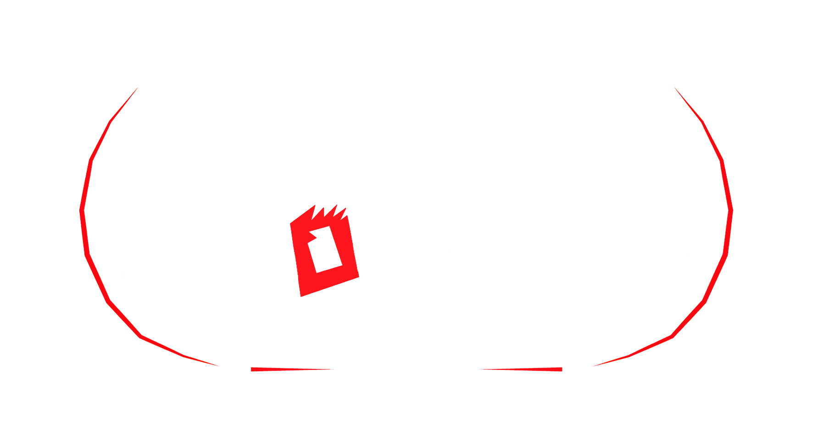



> The story of mother and daughter drifting apart.​  Water is where they have the connection and disconnection. The water of the womb and the seawater.​​ ​ The mother cannot enter the sea and the daughter wants to go to the deep.


  


### My Role

Composer & Sound Designer

### Technical Details

- All audio created in Logic Pro X
- The film has not yet been released

### Development Notes

I was very privileged to be invited by Julia Nicolescu, an awesome director and really good friend of mine, to create the soundtrack and sound design of See, a short film that resulted from her time in the Re:Anima Joint Master in Animation. She animated the whole piece using 2D digital animation mixed with paint on glass, which creates an amazing effect that I was very excited create a soundscape to.

The sound design of See is based on two fundamental elements: authentic sound effects of beach and underwater ambiences and the interaction between two melodic motifs, symbolizing the daughter and the mother. To achieve a realistic ambiance for the animation's setting and to create a contrast with the more ethereal moments of the narrative, a combination of effects from online libraries and foley techniques were employed. 

As for the music, the mother's melody embodies a deep, lower-octave sound with greater intervals between notes, representing age, patience, and care. In contrast, the daughter's melody is constructed upon a 4-note arpeggio, played in higher octaves, signifying playfulness and carefree spirit. However, as the story progresses, the daughter's melody gradually descends, representing her transition from childhood to adulthood and the growing proximity between mother and daughter. Although the melodies initially diverge, they eventually converge into a hybrid melody, symbolizing the strengthening of the bond between mother and daughter. Acoustic instrumentation, such as guitar and piano, was employed to maintain an organic sound and avoid any sense of artificiality.

It was a very demanding project, especially given that I was also working on Extremely Powerful Capybaras, but we were both very satisfied with the results after a year of on and off work, with lots of back and forth and pretty good direction from Julia's part. I'm excited to be able to show the full animation here, but the short hasn't been released yet, so for now, the trailer gives a good idea of the final result! Also please follow and hire [Julia](http://junicolescu.com), she's an amazing professional! 