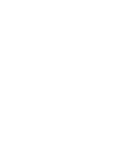



> *Welcome to the Skyways, caravaneer. Complete missions, manage your ship’s resources and make tough decisions to keep your crew alive and happy. Or not. Choices have lasting consequences in this Text-Based RPG. You are the captain - and the clouds are waiting!*


  
  
  
  


### My Role

Game Designer, Narrative Designer, Writer, Programmer, Composer, Sound Designer & Business Developer 

### Technical Details

- Released on [Steam](https://store.steampowered.com/app/1792270/Sky_Caravan/) in 2022
- Released on the [Nintendo Switch](https://www.nintendo.com/us/store/products/sky-caravan-switch/) in 2023 
- Developed in Unity and written in the [Ink](https://github.com/inkle/ink) scripting language
- Audio created in Logic Pro X, implemented with FMOD

### Development Notes

Sky Caravan is the first game I shipped on PC and a console, and it brings me immense joy to have introduced something so quirky, funny, and uniquely Brazilian into the world.

Our team at Studio Bravarda embarked on this project as a means to develop a smaller game and get it out the door faster than our then-current project, Terra Pulse. While one of my partners and I were primarily focused on finding publishers, the rest of the team came up with a concept that truly excited us: a narrative game where players choose with emojis, blending elements of Disney’s Treasure Planet with Brazilian culture. I was instantly hooked! We joked at the time about being so tired of dealing with collisions in Terra Pulse (a combat-heavy game) that we decided to make a game with no collisions at all. However, relying solely on words presented its own unique set of challenges.

Development began in May 2021, and after a full year of hard work, we shipped the game in May 2022. We developed the entire game using the Ink scripting language, a fantastic piece of technology by the folks at Inkle that was mostly a joy to work with, aside from a few hiccups I plan to delve into in a future article. This project marked the first time I was fully immersed in programming, handling all the front-end work for the game.

There's an interesting tidbit about this project: initially, we wanted to experiment with a "narrative roguelike." We crafted numerous small story moments that were pieced together by a procedural system. Pretty neat right? Well, it resulted in a narrative that felt incredibly flat and was nearly impossible to QA. Realizing this too late in development, around the 8-month mark, I proposed to the team that we completely pivot to a linear, character-driven game, adapting all the story moments into specific tailored events that we could polish to the max. I was scared to death of everyone’s reaction, but to my surprise, the reaction from everyone was “God, please, yes!”. Don't mess with procedural narratives.

So we rewrote approximately 50k words of interactive narrative in the next 4 months, along with writing the final 40k words, totaling 180k words in English and Portuguese. It was a wild ride. I'm incredibly proud of the end result and we were also fortunate to receive nominations for some cool awards, which meant a lot to us as it was our first game.

This project also marked the first time I composed a soundtrack from beginning to end, crafting a complete arc of themes and characters. I can't put into words how fulfilling it was, after a lifetime of playing JRPGs and analyzing their music motifs, to be able to create my own, while incorporating very Brazilian instruments like the pandeiro, nylon guitar, and cavaquinho to create a unique soundscape.

Seeing my game on a Nintendo console was also a dream come true, made possible thanks to Studio Bravarda’s partnership with RedDeer Games, who handled the porting to the Switch.

If someone had told me as a kid that I would one day put a talking anteater chef on a Nintendo console, I’d be flabbergasted—but extremely interested.

### Extras

The entire game's script is publicly available in my Github.


